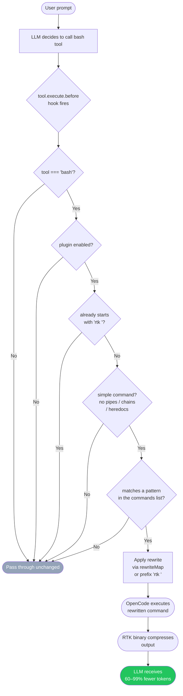

<div align="center">

# opencode-rtk

**Your LLM agent is burning tokens on CLI output. This plugin fixes that.**

An [OpenCode](https://opencode.ai) plugin that transparently rewrites bash commands to use [RTK](https://github.com/rtk-ai/rtk), cutting token consumption by **60--99%** — zero config required.

<!-- [](https://www.npmjs.com/package/opencode-rtk) -->
<!-- [](https://www.npmjs.com/package/opencode-rtk) -->
<!-- [](https://github.com/monachy/opencode-rtk/stargazers) -->
<!-- [](https://github.com/monachy/opencode-rtk/issues) -->
[](https://github.com/monachy/opencode-rtk/blob/main/LICENSE)

</div>

---

## Contents

- [Overview](#overview)
  - [How It Works](#how-it-works)
  - [Token Savings](#token-savings)
- [Installation](#installation)
  - [Prerequisites](#prerequisites)
  - [Option 1 — npm plugin (recommended)](#option-1--npm-plugin-recommended)
  - [Option 2 — bunx / npx](#option-2--bunx--npx)
  - [Option 3 — local clone](#option-3--local-clone)
- [Configuration](#configuration)
  - [Config Reference](#config-reference)
  - [Prefix Matching](#prefix-matching)
  - [Supported RTK Commands](#supported-rtk-commands)
  - [What Gets Skipped](#what-gets-skipped)
  - [Debugging](#debugging)
- [Known Limitations](#known-limitations)
- [License](#license)

---

## Overview

Every time your LLM agent runs `git status`, `cargo test`, or `cat` through OpenCode, the raw output floods the context window with thousands of tokens the model doesn't actually need. **opencode-rtk** hooks into `tool.execute.before` and silently rewrites eligible commands to use RTK — a Rust-based CLI proxy that compresses output before the LLM ever sees it.

You install it once. It works automatically from that point on. No prompt changes, no workflow changes.

### How It Works



### Token Savings

| Command | Before | After | Savings |
|---|---|---|---|
| `git status` | ~120 tokens | ~30 tokens | **75%** |
| `cargo test` | ~4,823 tokens | ~11 tokens | **99%** |
| `cat src/main.rs` | ~10,176 tokens | ~504 tokens | **95%** |
| `ls` | ~200 tokens | ~40 tokens | **80%** |
| `docker ps` | ~300 tokens | ~60 tokens | **80%** |

---

## Installation

### Prerequisites

- [OpenCode](https://opencode.ai) installed
- [RTK](https://github.com/rtk-ai/rtk) binary installed and in `PATH`

```bash
rtk --version   # verify RTK is installed
```

### Option 1 — npm plugin (recommended)

Add `opencode-rtk` to your OpenCode config. OpenCode installs it automatically via Bun on startup:

**`~/.config/opencode/opencode.json`**
```json
{
  "plugin": ["opencode-rtk"]
}
```

That's it.

### Option 2 — bunx / npx

```bash
# with Bun
bunx opencode-rtk

# with npm
npx opencode-rtk
```

Then add it to your `opencode.json` as shown in Option 1.

### Option 3 — local clone

```bash
git clone https://github.com/monachy/opencode-rtk.git
cd opencode-rtk
bun install
bun run build
```

Reference the local path in your config:

**`~/.config/opencode/opencode.json`**
```json
{
  "plugin": ["/absolute/path/to/opencode-rtk"]
}
```

---

## Configuration

On first load, the plugin **auto-generates** `~/.config/opencode/rtk-wrapper-config.json` with sensible defaults. Edit it to customize which commands are wrapped.

**`~/.config/opencode/rtk-wrapper-config.json`**
```json
{
  "enabled": true,
  "commands": [
    "git status", "git diff", "git log",
    "ls", "cat", "rg", "grep", "find",
    "cargo", "docker", "kubectl", "pytest",
    "go test", "go build", "go vet",
    "vitest", "eslint", "tsc", "ruff",
    "pip", "golangci-lint", "prettier",
    "curl", "gh", "npm test"
  ],
  "rewriteMap": {
    "cat": "rtk read",
    "rg": "rtk grep",
    "eslint": "rtk lint"
  }
}
```

> Config changes take effect on the next OpenCode restart.

### Config Reference

| Field | Type | Description |
|---|---|---|
| `enabled` | `boolean` | Global kill switch. Set to `false` to disable without uninstalling. |
| `commands` | `string[]` | Command prefixes to wrap. Uses word-boundary prefix matching. |
| `rewriteMap` | `object` | Commands whose RTK equivalent differs from the original (e.g. `cat` -> `rtk read`). |

### Prefix Matching

Each entry in `commands` is matched against the start of the bash command with a word boundary:

| Pattern | Command | Match? |
|---|---|---|
| `"git status"` | `git status -s` | Yes |
| `"git status"` | `git diff` | No — different subcommand |
| `"git"` | `git diff HEAD~1` | Yes |
| `"ls"` | `ls -la src/` | Yes |
| `"ls"` | `lsof` | No — no word boundary |
| `"cat"` | `cat file.txt` | Yes — rewritten via `rewriteMap` |

### Supported RTK Commands

| Command | RTK Equivalent | Savings |
|---|---|---|
| `git status/diff/log/...` | `rtk git ...` | 75--92% |
| `gh pr/issue/run` | `rtk gh ...` | ~80% |
| `cargo test/build/clippy` | `rtk cargo ...` | 90--99% |
| `cat <file>` | `rtk read <file>` | 70--95% |
| `rg` / `grep` | `rtk grep` | 50--80% |
| `ls` | `rtk ls` | 80% |
| `find` | `rtk find` | 46--78% |
| `docker ps/images/logs` | `rtk docker ...` | 80% |
| `kubectl get/logs/services` | `rtk kubectl ...` | ~80% |
| `pytest` | `rtk pytest` | 90% |
| `go test/build/vet` | `rtk go ...` | 58--90% |
| `vitest` | `rtk vitest run` | ~90% |
| `eslint` | `rtk lint` | ~80% |
| `tsc` | `rtk tsc` | ~80% |
| `ruff` | `rtk ruff ...` | 80% |
| `pip` | `rtk pip ...` | 70--85% |
| `golangci-lint` | `rtk golangci-lint run` | 85% |
| `prettier` | `rtk prettier` | ~70% |
| `curl` | `rtk curl` | ~60% |
| `npm test` | `rtk test npm test` | ~90% |

### What Gets Skipped

The plugin automatically skips commands that can't be safely rewritten:

- Already prefixed with `rtk` (prevents double-wrapping)
- Contains pipes (`|`), chains (`&&`, `||`), semicolons (`;`), or heredocs (`<<`)
- Not in the `commands[]` list

### Debugging

Plugin logs are written at `debug` level under `opencode-rtk`. Enable OpenCode's debug mode to see rewrite activity:

```
[opencode-rtk] RTK plugin loaded. Wrapping 25 command patterns.
[opencode-rtk] RTK rewrite: "git status" -> "rtk git status"
[opencode-rtk] RTK rewrite: "cat src/main.rs" -> "rtk read src/main.rs"
```

---

## Known Limitations

- **Compound commands are skipped.** `git add . && git commit -m "msg"` won't be rewritten. The LLM typically runs commands individually anyway.
- **No `tree` support.** RTK does not implement `tree`.
- **RTK must be in PATH.** If `rtk` is not found, the rewritten command will fail with `command not found`.
- **Config reload requires restart.** Edit the JSON, then restart OpenCode.

---

## License

MIT
