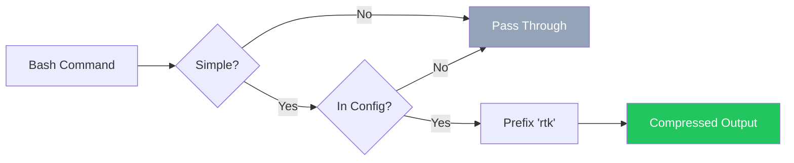

<div align="center">

# opencode-rtk

**Cut your LLM's token consumption by 60-99%** with zero configuration.

An [OpenCode](https://opencode.ai) plugin that transparently rewrites bash commands to use [RTK](https://github.com/rtk-ai/rtk) — a Rust-based CLI proxy that compresses output before it reaches your AI's context window.

[](https://github.com/monachy/opencode-rtk/blob/main/LICENSE)

</div>

---

## Contents

- [Quick Start](#quick-start)
- [Why This Matters](#why-this-matters)
- [How It Works](#how-it-works)
- [Token Savings](#token-savings)
- [Installation](#installation)
- [Configuration](#configuration)
- [Supported Commands](#supported-commands)
- [Troubleshooting](#troubleshooting)
- [Known Limitations](#known-limitations)
- [License](#license)

---

## Quick Start

Get started in 30 seconds:

```bash
# 1. Install RTK (if not already installed)
cargo install rtk-cli

# 2. Add plugin to OpenCode config
# Edit: ~/.config/opencode/opencode.json
echo '{"plugin": ["opencode-rtk"]}' > ~/.config/opencode/opencode.json

# 3. Restart OpenCode. Done.
```

That's it. From now on, every eligible command is automatically compressed.

---

## Why This Matters

Every time your LLM runs `git status`, `cargo test`, or `cat` through OpenCode, the raw output floods the context window with thousands of tokens the model doesn't actually need. This plugin intercepts those commands and compresses them before the LLM ever sees them.

**The cost adds up quickly:**

| Scenario | Without RTK | With RTK | Tokens Saved |
|----------|-------------|----------|--------------|
| Daily development (100 commands) | ~50,000 tokens | ~5,000 tokens | **45,000** |
| Large codebase review | ~100,000 tokens | ~10,000 tokens | **90,000** |
| CI/CD log analysis | ~500,000 tokens | ~25,000 tokens | **475,000** |

You install it once. It works automatically. No prompt changes, no workflow changes.

---

## How It Works



The plugin hooks into `tool.execute.before` and silently rewrites eligible commands to use RTK. Complex commands (pipes, chains, heredocs) are passed through unchanged for safety.

---

## Token Savings

Real-world savings on common commands:

| Command | Before | After | Savings |
|---------|--------|-------|---------|
| `git status` | ~120 tokens | ~30 tokens | **75%** |
| `cargo test` | ~4,823 tokens | ~11 tokens | **99%** |
| `cat src/main.rs` | ~10,176 tokens | ~504 tokens | **95%** |
| `ls -la` | ~200 tokens | ~40 tokens | **80%** |
| `docker ps` | ~300 tokens | ~60 tokens | **80%** |
| `pytest` | ~5,000 tokens | ~500 tokens | **90%** |

---

## Installation

### Prerequisites

- [OpenCode](https://opencode.ai) installed
- [RTK](https://github.com/rtk-ai/rtk) binary installed and in `PATH`

```bash
rtk --version   # verify RTK is installed
```

### Option 1: npm plugin (recommended)

Add to your OpenCode config:

**`~/.config/opencode/opencode.json`**
```json
{
  "plugin": ["opencode-rtk"]
}
```

OpenCode installs it automatically via Bun on startup.

### Option 2: Local development

```bash
git clone https://github.com/monachy/opencode-rtk.git
cd opencode-rtk
bun install
bun run build
```

Then reference the local path:

**`~/.config/opencode/opencode.json`**
```json
{
  "plugin": ["/absolute/path/to/opencode-rtk"]
}
```

---

## Configuration

The plugin auto-generates `~/.config/opencode/rtk-wrapper-config.json` on first load with sensible defaults. Edit it to customize which commands are wrapped.

**`~/.config/opencode/rtk-wrapper-config.json`**
```json
{
  "enabled": true,
  "commands": [
    "git status", "git diff", "git log",
    "ls", "cat", "rg", "grep", "find",
    "cargo", "docker", "kubectl", "pytest",
    "go test", "go build", "go vet",
    "vitest", "eslint", "tsc", "ruff",
    "pip", "golangci-lint", "prettier",
    "curl", "gh", "npm test"
  ],
  "rewriteMap": {
    "cat": "rtk read",
    "rg": "rtk grep",
    "eslint": "rtk lint"
  }
}
```

> Config changes take effect on the next OpenCode restart.

### Config Reference

| Field | Type | Description |
|-------|------|-------------|
| `enabled` | `boolean` | Global kill switch. Set to `false` to disable without uninstalling. |
| `commands` | `string[]` | Command prefixes to wrap. Uses word-boundary prefix matching. |
| `rewriteMap` | `object` | Commands with different RTK equivalents (e.g., `cat` → `rtk read`). |

### Prefix Matching

Each entry in `commands` is matched against the start of the bash command with a word boundary:

| Pattern | Command | Match? |
|---------|---------|--------|
| `"git status"` | `git status -s` | Yes |
| `"git status"` | `git diff` | No — different subcommand |
| `"git"` | `git diff HEAD~1` | Yes |
| `"ls"` | `ls -la src/` | Yes |
| `"ls"` | `lsof` | No — no word boundary |

---

## Supported Commands

Commands are automatically rewritten when they match your config:

### Git & GitHub

| Original | Becomes | Savings |
|----------|---------|---------|
| `git status/diff/log` | `rtk git ...` | 75-92% |
| `gh pr/issue/run` | `rtk gh ...` | ~80% |

### Build Tools

| Original | Becomes | Savings |
|----------|---------|---------|
| `cargo test/build/clippy` | `rtk cargo ...` | 90-99% |
| `go test/build/vet` | `rtk go ...` | 58-90% |

### Docker & Kubernetes

| Original | Becomes | Savings |
|----------|---------|---------|
| `docker ps/images/logs` | `rtk docker ...` | 80% |
| `kubectl get/logs/services` | `rtk kubectl ...` | ~80% |

### Testing & Linting

| Original | Becomes | Savings |
|----------|---------|---------|
| `pytest` | `rtk pytest` | 90% |
| `vitest` | `rtk vitest run` | ~90% |
| `eslint` | `rtk lint` | ~80% |
| `tsc` | `rtk tsc` | ~80% |
| `ruff` | `rtk ruff ...` | 80% |
| `golangci-lint` | `rtk golangci-lint run` | 85% |

### File Operations

| Original | Becomes | Savings |
|----------|---------|---------|
| `cat <file>` | `rtk read <file>` | 70-95% |
| `ls` | `rtk ls` | 80% |
| `find` | `rtk find` | 46-78% |

### Search

| Original | Becomes | Savings |
|----------|---------|---------|
| `rg` / `grep` | `rtk grep` | 50-80% |

### Package Managers & Utils

| Original | Becomes | Savings |
|----------|---------|---------|
| `pip list/install` | `rtk pip ...` | 70-85% |
| `curl` | `rtk curl` | ~60% |
| `npm test` | `rtk test npm test` | ~90% |

---

## Troubleshooting

### RTK command not found

Ensure RTK is installed and in your PATH:

```bash
rtk --version
# Should show: rtk 0.x.x
```

If not installed:

```bash
cargo install rtk-cli
```

### Commands not being rewritten

1. **Check the plugin is enabled** in `rtk-wrapper-config.json`
2. **Verify the command is in the `commands` list**
3. **Check for pipes/chains** — these are skipped for safety:
   - `git status | grep modified` ❌ (contains pipe)
   - `git add . && git commit -m "msg"` ❌ (contains chain)
4. **Enable debug mode** to see rewrite activity in logs

### Enable debug logging

Plugin logs are written at `debug` level:

```
[opencode-rtk] RTK plugin loaded. Wrapping 25 command patterns.
[opencode-rtk] RTK rewrite: "git status" -> "rtk git status"
[opencode-rtk] RTK rewrite: "cat src/main.rs" -> "rtk read src/main.rs"
```

Enable OpenCode's debug mode to view these logs.

### Config changes not applying

**You must restart OpenCode** after editing `rtk-wrapper-config.json`. The config is loaded once at startup.

### Too aggressive / Not aggressive enough

Edit `~/.config/opencode/rtk-wrapper-config.json`:

- **Too aggressive?** Remove specific commands from the `commands` array
- **Not aggressive enough?** Add more commands or use broader patterns like `"git"` instead of `"git status"`

---

## Known Limitations

- **Compound commands are skipped.** Commands with pipes (`|`), chains (`&&`, `||`), semicolons (`;`), or heredocs (`<<`) won't be rewritten. The LLM typically runs commands individually anyway.
- **No `tree` support.** RTK does not implement `tree`.
- **RTK must be in PATH.** If `rtk` is not found, rewritten commands will fail with "command not found".
- **Config reload requires restart.** Edit the JSON, then restart OpenCode.

---

## License

MIT
