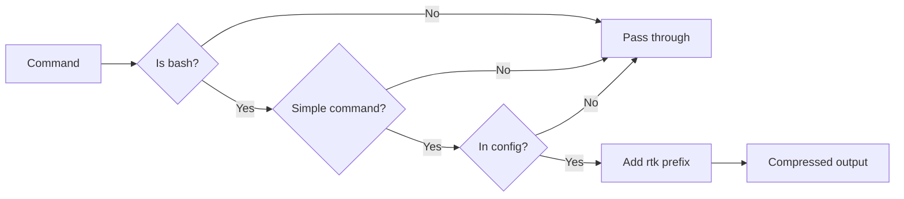

# README Enhancement Plan

**Date:** 2026-02-22  
**Status:** Draft  
**Scope:** Enhance README.md for better clarity, readability, and fix diagram size issues

---

## Current Issues

### 1. Diagram Size Problem
The Mermaid flowchart (lines 48-71) renders too large on GitHub, making it hard to view without excessive scrolling.

**Current:** 12 nodes with detailed branching logic
**Problem:** Spans full width, overwhelming visual

### 2. Content Clarity Issues

| Issue | Location | Impact |
|-------|----------|--------|
| Dense opening paragraph | Overview section | Hard to scan quickly |
| No quick start section | Missing | Users must read full doc to get started |
| Scattered installation options | Lines 96-137 | 3 options presented equally, no visual hierarchy |
| Overwhelming command table | Lines 191-212 | 25-row table hard to scan |
| Technical jargon without context | Throughout | Assumes prior RTK knowledge |

### 3. Missing Elements

- No "Why This Matters" section explaining token costs
- No categorized command list
- No troubleshooting section
- No emoji/visual indicators for scannability

---

## Enhancement Plan

### Phase 1: Structure Improvements

#### 1.1 Add Quick Start Section (Before Installation)

**Purpose:** Let users get started in 30 seconds

**Content:**
```markdown
## Quick Start

1. Install RTK: `cargo install rtk-cli` (or see [RTK docs](https://github.com/rtk-ai/rtk))
2. Add to OpenCode config:
   ```json
   {
     "plugin": ["opencode-rtk"]
   }
   ```
3. Restart OpenCode. Done.
```

#### 1.2 Reorganize Installation Section

**New hierarchy:**
- Prerequisites (check RTK installed first)
- Quick Install (Option 1 - npm, the recommended way)
- Alternative Methods (collapsible or secondary)
  - Option 2: bunx/npx
  - Option 3: local clone

#### 1.3 Add "Why This Matters" Section

**Purpose:** Explain the problem before the solution

**Content:**
- Token consumption visual
- Cost impact example
- Real-world scenario

### Phase 2: Fix Diagram Size

#### Option A: Simplify Mermaid Diagram (Recommended)

Replace the 12-node detailed flowchart with a 6-7 node simplified version:



**Benefits:**
- Horizontal layout (LR) fits better
- 6 nodes vs 12 nodes
- Still conveys the logic
- Uses word-boundary labels

#### Option B: Add Size Constraints (Fallback)

If keeping the detailed diagram, wrap in HTML:

```html
<div align="center" style="max-width: 800px;">

```mermaid
[diagram]
```

</div>
```

**Note:** GitHub doesn't always respect inline styles on Mermaid diagrams.

### Phase 3: Content Enhancements

#### 3.1 Add Emoji Indicators

| Section | Emoji | Purpose |
|---------|-------|---------|
| Overview | | Problem statement |
| Quick Start | | Get started fast |
| Installation | | Setup |
| Configuration | | Customize |
| Token Savings | | Show value |

#### 3.2 Categorize Commands

Replace the 25-row flat table with categorized sections:

**Git & GitHub:**
- `git status/diff/log` → `rtk git ...` (75–92% savings)
- `gh pr/issue/run` → `rtk gh ...` (~80% savings)

**Build Tools:**
- `cargo test/build/clippy` → `rtk cargo ...` (90–99% savings)
- `go test/build/vet` → `rtk go ...` (58–90% savings)

**Docker & K8s:**
- `docker ps/images/logs` → `rtk docker ...` (80% savings)
- `kubectl get/logs/services` → `rtk kubectl ...` (~80% savings)

**File Operations:**
- `cat <file>` → `rtk read <file>` (70–95% savings)
- `ls` → `rtk ls` (80% savings)
- `find` → `rtk find` (46–78% savings)

**Testing & Linting:**
- `pytest` → `rtk pytest` (90% savings)
- `vitest` → `rtk vitest run` (~90% savings)
- `eslint` → `rtk lint` (~80% savings)
- `ruff` → `rtk ruff ...` (80% savings)

**Search:**
- `rg` / `grep` → `rtk grep` (50–80% savings)

#### 3.3 Add Troubleshooting Section

**New section after Configuration:**

```markdown
## Troubleshooting

### RTK command not found
Ensure RTK is installed and in PATH:
```bash
rtk --version
```

### Commands not being rewritten
1. Check plugin is enabled in config
2. Verify command is in the `commands` list
3. Check for pipes/chains (these are skipped)
4. Enable debug mode to see rewrite logs

### Too aggressive/Not aggressive enough
Edit `~/.config/opencode/rtk-wrapper-config.json` and restart OpenCode.
```

### Phase 4: Visual Polish

#### 4.1 Fix Range Notation

Replace `--` with proper en-dash or simplified ranges:
- `60--99%` → `60-99%` or `60% to 99%`
- `75--92%` → `75-92%`

#### 4.2 Add Copy-Friendly Code Blocks

Ensure all config examples are copy-paste ready with full paths.

#### 4.3 Improve Token Savings Table

Current table is good but could use:
- Visual indicator for highest savings
- Consistent decimal formatting
- Maybe a simple bar chart representation

---

## Implementation Steps

### Step 1: Backup Current README
```bash
cp README.md README.md.backup
```

### Step 2: Create New README Structure

1. Header with badges (keep existing)
2. One-liner value prop (enhanced)
3. Quick Start (NEW)
4. Why This Matters (NEW)
5. How It Works (simplified diagram)
6. Token Savings (keep existing table)
7. Installation (restructured)
8. Configuration (enhanced)
9. Supported Commands (categorized)
10. Troubleshooting (NEW)
11. Known Limitations (keep)
12. License (keep)

### Step 3: Test Diagram Rendering

After writing, preview on GitHub to ensure diagram displays correctly at reasonable size.

### Step 4: Review and Refine

- Check all links work
- Verify code blocks copy correctly
- Ensure formatting renders properly

---

## Success Criteria

- [ ] Diagram fits within 800px width on desktop
- [ ] New user can get started in < 2 minutes
- [ ] Command reference is scannable (< 10 seconds to find specific command)
- [ ] Token savings are immediately visible
- [ ] Troubleshooting section addresses 80% of common issues
- [ ] Overall length is similar or shorter than original (245 lines)

---

## Notes

- Keep existing tone: technical but approachable
- Maintain all existing information (don't remove content, reorganize it)
- Test Mermaid diagram on GitHub before finalizing
- Consider adding a "See it in action" section with GIF/screenshots (future)
